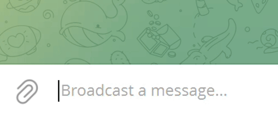
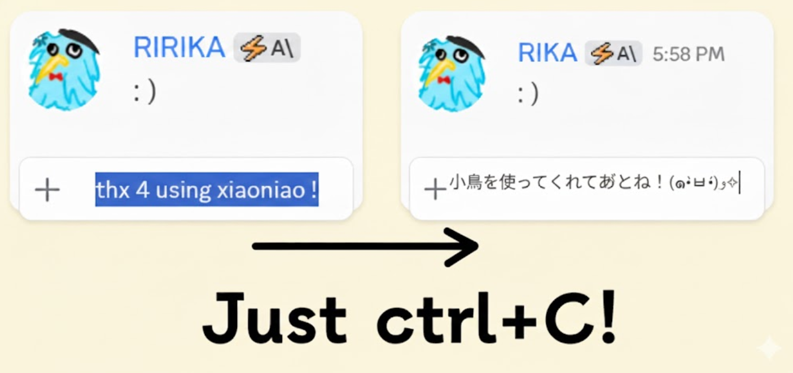
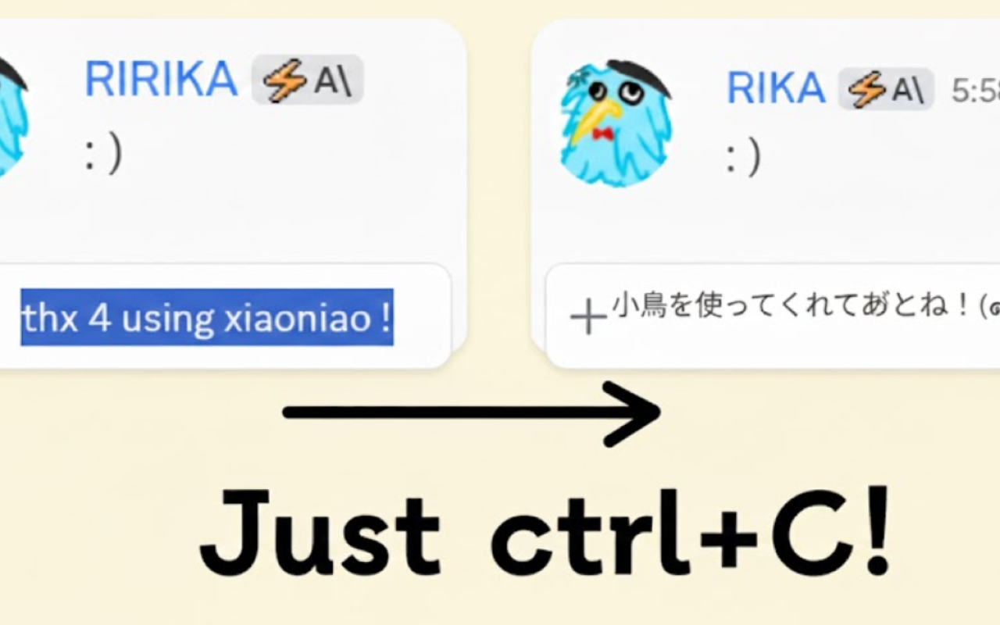
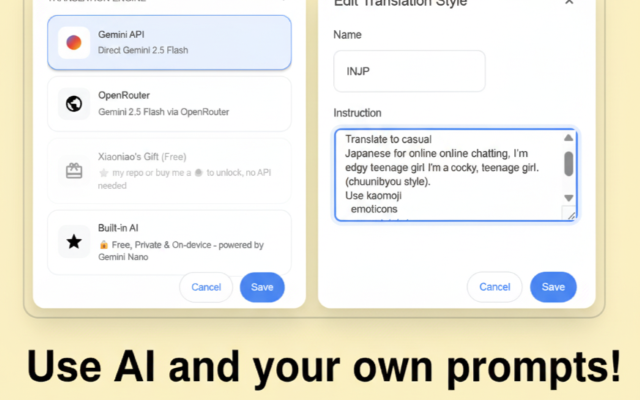

# xiaoniao

## 빠른 시작

### 1. API 키 설정

- 메인 메뉴에서 "API 설정" 선택
- API 키 입력 (OpenAI, Anthropic 등)
- 시스템이 자동으로 제공업체 식별

### 2. 모델 선택

- API 설정 후 "모델 선택" 선택
- 목록에서 적합한 AI 모델 선택

### 3. 단축키 설정 (선택사항)

- 메인 메뉴에서 "단축키 설정" 선택
- 모니터링 토글 및 프롬프트 전환 단축키 설정

### 4. 사용 시작

- Ctrl+X로 잘라내기 또는 Ctrl+C로 복사하여 번역 시작
- 프로그램이 자동으로 클립보드 내용 교체
- Ctrl+V로 번역 결과 붙여넣기

## 다운로드

[xiaoniao.exe](https://github.com/kaminoguo/xiaoniao/releases/latest) - Windows 10/11 (64-bit)

## 업데이트 방법

1. 기존 xiaoniao.exe 삭제
2. 새 xiaoniao.exe 다운로드
3. 설정 파일은 자동 저장되어 손실되지 않음

 Chrome 확장 프로그램

## 빠른 시작

### 1. 확장 프로그램 설치

- Chrome 웹 스토어에서 설치 (곧 출시)
- 또는 수동 로드：`chrome://extensions` 열기、개발자 모드 활성화、`chrome/` 폴더 로드

### 2. 번역 모드 설정

- 팝업에서 번역 모드 선택
- Built-in AI：무료、프라이빗、기기 내 실행 (Gemini Nano)
- Gemini API：더 높은 정확도를 위해 API 키 입력
- 무료 체험：제공된 기프트 키 사용 (제한된 할당량)

### 3. 번역 스타일 설정 (선택사항)

- 팝업에서 \"번역 스타일\" 클릭
- 프리셋에서 선택하거나 커스텀 스타일 생성
- 예시：\"이모티콘을 사용한 캐주얼 일본어로 번역\"

### 4. 사용 시작

- 임의의 텍스트 복사 (Ctrl+C)
- 확장 프로그램이 자동 번역하고 자동 붙여넣기

## 다운로드

[다운로드 v1.0.1](https://github.com/kaminoguo/xiaoniao/releases/tag/chrome-v1.0.1) | Chrome 웹 스토어：곧 출시

## 브라우저 요구사항

Chrome 127+ (Built-in AI 모드용)

 - 개발 중

업데이트를 기다려 주세요!

 - 개발 중

업데이트를 기다려 주세요!

### 비디오 튜토리얼

-  Bilibili: [https://www.bilibili.com/video/BV13zpUzhEeK/](https://www.bilibili.com/video/BV13zpUzhEeK/)
-  YouTube: [https://www.youtube.com/watch?v=iPye0tYkBaY](https://www.youtube.com/watch?v=iPye0tYkBaY)

## 후원

