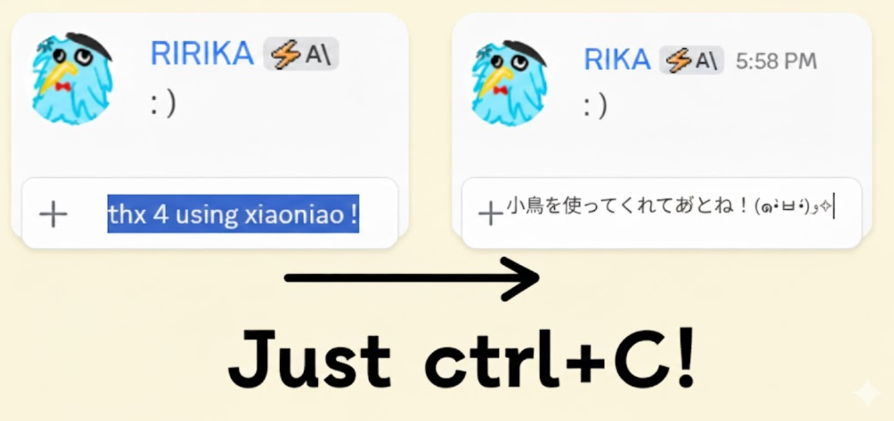

# xiaoniao

## 快速上手

### 1. 配置API密钥

- 在主菜单选择"API配置"
- 输入你的API密钥（如OpenAI、Anthropic等）
- 系统会自动识别提供商

### 2. 选择模型

- 设置API后，选择"选择模型"
- 从列表中选择合适的AI模型

### 3. 设置快捷键（可选）

- 在主菜单选择"快捷键设置"
- 设置监控开关和切换prompt的快捷键

### 4. 开始使用

- Ctrl+X 剪切或 Ctrl+C 复制文本触发翻译
- 程序会自动替换剪贴板内容
- Ctrl+V 粘贴翻译结果

## 下载

[xiaoniao.exe](https://github.com/kaminoguo/xiaoniao/releases/latest) - Windows 10/11 (64-bit)

## 更新方法

1. 删除旧版本的 xiaoniao.exe
2. 下载新版本的 xiaoniao.exe
3. 配置文件自动保存在电脑，不会丢失

 Chrome 扩展

## 快速上手

### 1. 安装扩展

- 从 Chrome 应用商店安装（即将推出）
- 或手动加载：打开 `chrome://extensions`，启用开发者模式，加载 `chrome/` 文件夹

### 2. 配置翻译模式

- 在弹窗中选择翻译模式
- Built-in AI：免费、隐私、本地运行（Gemini Nano）
- Gemini API：输入你的 API 密钥以获得更高准确度
- 免费试用：使用我们提供的礼物密钥（限量）

### 3. 设置翻译风格（可选）

- 在弹窗中点击"翻译风格"
- 从预设中选择或创建自定义风格
- 示例："翻译成网络聊天日语，使用颜文字"

### 4. 开始使用

- 复制任意文字（Ctrl+C）
- 扩展自动翻译并自动粘贴结果

## 下载

Chrome 应用商店：即将推出 | [源代码](https://github.com/kaminoguo/xiaoniao/tree/main/chrome)

## 浏览器要求

Chrome 127+ (Built-in AI 模式需要)

 - 开发中

敬请期待更新！

 - 开发中

敬请期待更新！

### 视频教程

-  Bilibili: [https://www.bilibili.com/video/BV13zpUzhEeK/](https://www.bilibili.com/video/BV13zpUzhEeK/)
-  YouTube: [https://www.youtube.com/watch?v=iPye0tYkBaY](https://www.youtube.com/watch?v=iPye0tYkBaY)

## 支持作者

